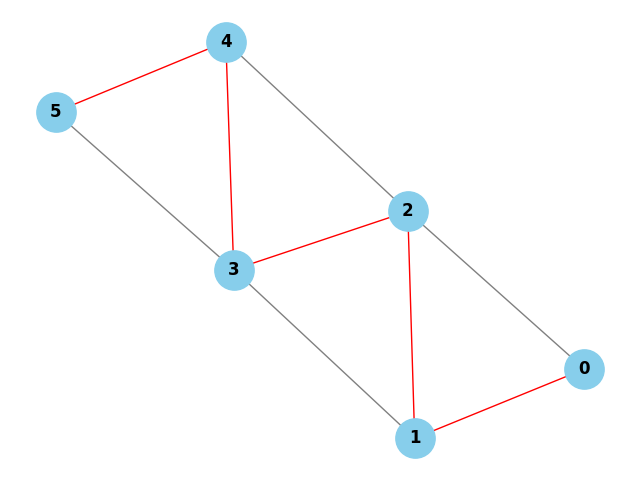

# Caminho Hamiltoniano com Backtracking em Python

## Descrição do Projeto

Este projeto consiste na implementação de um algoritmo para encontrar um **Caminho Hamiltoniano** em um grafo não orientado, utilizando **backtracking**, com visualização gráfica através das bibliotecas `networkx` e `matplotlib`.

O algoritmo está estruturado no arquivo `main.py` e conta com uma visualização implementada no arquivo `view.py`, que gera uma imagem do grafo com o caminho encontrado em destaque.

### Lógica do Algoritmo (linha por linha)

#### `is_safe(v, pos, path, graph)`
Verifica se é seguro adicionar o vértice `v` na posição `pos` do caminho:
1. Verifica se existe uma aresta entre o vértice anterior `path[pos - 1]` e o vértice `v`. Se não houver, retorna `False`.
2. Verifica se `v` já está presente no caminho (evita repetição de vértices). Se estiver, retorna `False`.
3. Se as duas condições forem satisfeitas, retorna `True`.

#### `hamiltonian_util(graph, path, pos)`
Função recursiva que tenta construir o caminho Hamiltoniano:
1. Caso base: se `pos` for igual ao número total de vértices, significa que todos os vértices foram incluídos no caminho. Retorna `True`.
2. Para cada vértice `v` (de 1 até n-1):
   - Verifica se `v` é seguro para ser adicionado.
   - Se for, adiciona `v` ao caminho na posição `pos`.
   - Chama recursivamente a função para a próxima posição.
   - Se a chamada recursiva retornar `True`, propaga o resultado.
   - Caso contrário, faz o backtrack (remove `v` do caminho).
3. Se nenhum vértice pode ser adicionado, retorna `False`.

#### `hamiltonian_path(graph)`
Função principal que inicia a busca pelo caminho Hamiltoniano:
1. Cria uma lista `path` preenchida com -1 indicando que os vértices ainda não foram visitados.
2. Define o primeiro vértice do caminho como 0 (ponto de partida).
3. Chama `hamiltonian_util()` com a posição inicial 1.
4. Se um caminho for encontrado, imprime e retorna o caminho. Caso contrário, imprime uma mensagem indicando a inexistência do caminho.

#### `visualizar_grafo_com_caminho(graph, caminho)` (em `view.py`)
Função de visualização utilizando NetworkX:
1. Cria o grafo e adiciona os nós e arestas com base na matriz de adjacência.
2. Se um caminho Hamiltoniano foi encontrado, destaca as arestas do caminho em vermelho.
3. Salva a imagem como `grafo_hamiltoniano.png` na pasta `assets`.

---

##  Como executar o projeto

### Requisitos:
- Python 3.7 ou superior
- Pip

### Instalação das dependências

Execute o seguinte comando no terminal:

```bash
pip install networkx matplotlib
```

### Executar o projeto

No terminal, rode:

```bash
python main.py
```

A imagem do grafo será salva na pasta `assets/` com o nome `grafo_hamiltoniano.png`.

---

##  Relatório Técnico

###  Análise da Complexidade Computacional

#### Classes de Complexidade: P, NP, NP-Completo e NP-Difícil

**P (Tempo Polinomial):**
Problemas resolvidos de forma eficiente por algoritmos determinísticos, com tempo de execução limitado por um polinômio da entrada. Exemplo: ordenação de listas.

**NP (Tempo Polinomial Não Determinístico):**
Problemas em que a solução pode ser verificada rapidamente (em tempo polinomial), mesmo que encontrar a solução não seja trivial. O Caminho Hamiltoniano se enquadra nessa classe, pois dado um caminho, é possível verificar se ele é Hamiltoniano em tempo linear.

**NP-Completo:**
Problemas que estão em NP e para os quais qualquer outro problema de NP pode ser reduzido. Se qualquer problema NP-Completo puder ser resolvido em tempo polinomial, todos os problemas em NP também poderão. O Caminho Hamiltoniano é **NP-Completo**, pois:
- Está em NP (como explicado acima).
- É ao menos tão difícil quanto qualquer outro problema em NP.
- Está diretamente relacionado ao Problema do Caixeiro Viajante (TSP), que também é NP-Completo.

**NP-Difícil:**
Problemas que podem ser mais difíceis que NP, onde nem mesmo a verificação de soluções pode ser feita em tempo polinomial. Exemplo: versões de otimização de alguns problemas NP-Completo.

#### Relação com o Caixeiro Viajante (TSP):
O Caminho Hamiltoniano pode ser visto como a versão não ponderada do TSP. Ambos têm o objetivo de visitar todos os vértices exatamente uma vez. No TSP, há a preocupação com o menor custo total do caminho, o que torna o problema ainda mais desafiador.

Portanto, o problema tratado neste projeto compartilha a complexidade e a dificuldade computacional dos problemas mais emblemáticos da teoria da complexidade, sendo um caso clássico de problema NP-Completo.

---

###  Complexidade Assintótica de Tempo

#### 1. Determinação da complexidade temporal
O algoritmo explora todas as possíveis permutações dos vértices do grafo para tentar formar um caminho Hamiltoniano válido. Isso resulta em uma árvore de decisão onde cada nível representa uma escolha de vértice, e o número total de combinações possíveis é (n-1)!, já que o primeiro vértice é fixo.

**Complexidade de tempo:**
- Pior caso: **O(n!)**, onde n é o número de vértices.
- Melhor caso: **O(n)**, quando o primeiro caminho testado é válido.

#### 2. Método de análise
A complexidade foi determinada utilizando **contagem de operações**, considerando o número de caminhos possíveis (permutações). O algoritmo testa todas as ordens possíveis de visitação dos vértices até encontrar um caminho válido, o que leva ao crescimento fatorial do tempo de execução.

---

###  Aplicação do Teorema Mestre

#### O Teorema Mestre se aplica?
**Não.** O algoritmo não apresenta uma recorrência no formato:

```
T(n) = aT(n/b) + f(n)
```

#### Justificativa:
O Teorema Mestre é apropriado para algoritmos de divisão e conquista, como mergesort ou quicksort. O algoritmo de backtracking utilizado neste projeto segue uma abordagem baseada em tentativa e erro recursivo, formando uma árvore de chamadas cuja profundidade e ramificações são determinadas pelas conexões do grafo, e não por uma divisão proporcional do problema.

---

###  Análise dos Casos de Complexidade

#### 1. Diferenças entre os casos:
- **Melhor caso O(n)**: O primeiro caminho testado já é válido, comum em grafos altamente conectados.
- **Caso médio O((n/2)!)**: Vários caminhos são testados antes do sucesso. Depende da densidade do grafo e da ordem dos vértices.
- **Pior caso O(n!)**: Nenhum caminho é válido, ou o válido é encontrado por último. O algoritmo testa todas as permutações possíveis.

#### 2. Impacto no desempenho:
- A performance melhora em grafos densos (muitas conexões), pois há mais possibilidades válidas de caminho.
- Em grafos esparsos, o algoritmo realiza mais chamadas de backtrack, o que aumenta o tempo de execução.
- A escolha inicial dos vértices influencia o tempo total: se vértices promissores forem testados primeiro, o tempo pode reduzir consideravelmente.

---

##  Visualização Gráfica

A imagem do grafo é gerada automaticamente com os seguintes recursos:

- **Grafo completo:** Todos os nós e arestas desenhados com etiquetas.
- **Caminho Hamiltoniano:** Arestas do caminho em vermelho.
- **Arquivo:** `assets/grafo_hamiltoniano.png`

### Exemplo de imagem gerada



---


